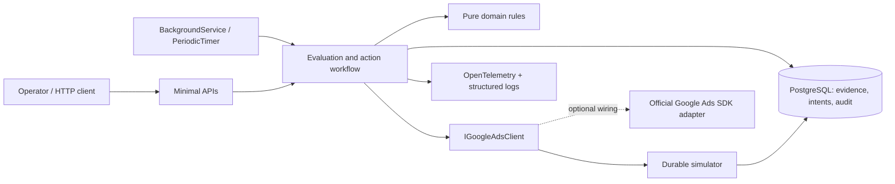
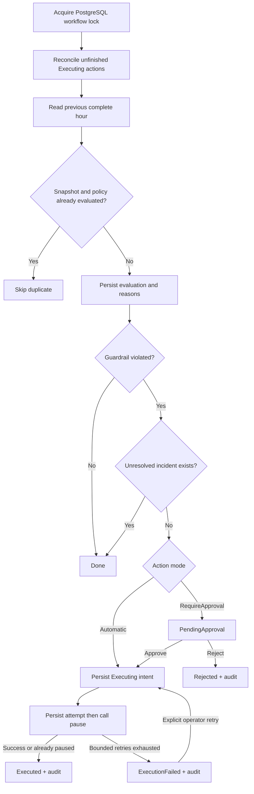

# Paid Traffic Automation

[](https://github.com/pgrzenko/paid-traffic-automation-dotnet/actions/workflows/ci.yml)

Production-oriented .NET service for campaign monitoring, business-rule evaluation, safe automated actions, and operational auditability.

Reduce the time between an advertising campaign becoming inefficient and an operator taking action. Configure spending guardrails, choose automatic intervention or human approval, and retain the evidence behind every decision.

**Runs without Google Ads credentials.** The complete demo uses a durable, deterministic simulator. An official Google Ads SDK adapter is compiled with the application but deliberately not enabled for live advertising accounts.

## Business Problem

Campaign teams cannot continuously inspect every campaign. A campaign can consume budget while producing no conversions, or generate revenue below its acquisition cost. Manual checks leave a gap between detecting a problem and stopping further spend.

Automation closes that gap only if operators can trust its decisions, control its authority, and reconstruct what happened after a failure. This project treats approval, evidence, retries, and recovery as part of the product.

## What the Service Does

1. Collects performance for the previous complete UTC hour.
2. Evaluates each configured campaign against an immutable policy.
3. Saves the snapshot, reasons, and decision.
4. Creates one incident and one pause action for a violation, unless an unresolved incident already exists.
5. Pauses automatically or waits for an operator to approve or reject.
6. Records each dispatch attempt and its final outcome in an append-only audit trail.
7. Recovers interrupted actions and emits operational logs, traces, and metrics.

The initial rules are **spend above a limit with zero conversions** and **ROAS below a minimum after a spend floor**. Money uses `decimal`; Google Ads cost micros are converted without intermediate floating-point arithmetic. Fractional attributed conversions are supported. Currencies must match; no exchange-rate conversion is attempted.

## Example Scenario

| Campaign | Performance | Policy | Result |
|---|---|---|---|
| `1001`: Spend without return | Enabled; $75 spend; 0 conversions; $0 revenue | Pause above $50 without a conversion | Automatically paused |
| `1002`: Approval required | Same performance | Same threshold; approval required | Remains enabled until approved |
| `1003`: Healthy campaign | $40 spend; 4 conversions; $200 revenue | $50 threshold | No incident |
| `1004`: Low ROAS | $100 spend; 2 conversions; $50 revenue | Minimum ROAS 1.5; spend floor $20 | Automatically paused |
| `1005`: Transient provider failure | $75 spend; 0 conversions | $50 threshold | First call fails; retry pauses it |
| `1006`: Already paused | Paused; $75 spend | $50 threshold | Excluded from evaluation |
| `1007`: Unconfigured campaign | $10 spend; 1 conversion; $30 revenue | None initially | Available for policy-creation demo |

Exactly $50 does **not** violate the $50 spend limit. Exactly the minimum ROAS passes. Zero spend has undefined ROAS and does not trigger that rule. Both rules can contribute reasons to one incident.

## Architecture

A modular monolith: one deployable ASP.NET Core service, one PostgreSQL database, and a provider boundary. No queue or scheduler service is needed for this scale.



The simulator stores its provider state in the same physical database through a **separate context and commit**, so tests exercise the failure window between an external effect and workflow persistence. A real provider does not share this database.

```text
src/PaidTraffic.Domain/          Rules, money conversion, legal state transitions
src/PaidTraffic.Api/
  Integration/                  Provider contract, simulator, official SDK adapter
  Operations/                   Workflow, worker, coordination, telemetry
  Persistence/                  EF mappings, migrations, demo seed
tests/PaidTraffic.Domain.Tests/  Pure boundary and rule tests
tests/PaidTraffic.IntegrationTests/ Real PostgreSQL + HTTP + failure injection
docs/decisions/                 Architecture decision records
```

## Decision Flow



## Technology

| Choice | Reason |
|---|---|
| .NET 10 LTS / C# / Minimal APIs | Supported LTS baseline; a small service does not need controller or mediator layers |
| EF Core 10 + Npgsql / PostgreSQL 17 | Transactions, unique constraints, append-only audit triggers, and cross-process advisory locks |
| Official `Google.Ads.GoogleAds` SDK | A compiled, typed integration boundary with explicit units and failure classification |
| Polly 8 | Bounded exponential retry and per-attempt timeout around external pause calls |
| OpenTelemetry | Portable traces and business metrics; JSON console logs retain correlation |
| xUnit / WebApplicationFactory / Testcontainers | Domain tests plus real relational behavior and real HTTP routing |
| Docker Compose / GitHub Actions | Credential-free local demonstration and clean Linux validation |

SDK `10.0.401` is pinned in `global.json`; Microsoft packages use `10.0.12`, Npgsql EF uses `10.0.3`, and lock files fix the transitive graph. These were checked against available packages before implementation. See [ADR 006](docs/decisions/006-runtime-and-dependencies.md) and the [official .NET support policy](https://dotnet.microsoft.com/en-us/platform/support/policy/dotnet-core).

## Running Locally

Prerequisite: Docker with Linux containers and Docker Compose v2. Ports 8080 and 5432 must be free. No locally installed .NET SDK or Google credentials are needed for the container path.

```sh
docker compose up --build
```

Compose starts PostgreSQL, runs a one-shot migration/seed container, then starts the API. The API runs as a non-root user. Both published ports bind to loopback.

- Health: [http://localhost:8080/health](http://localhost:8080/health)
- Campaigns: [http://localhost:8080/api/campaigns](http://localhost:8080/api/campaigns)
- OpenAPI JSON: [http://localhost:8080/openapi/v1.json](http://localhost:8080/openapi/v1.json)

The Compose password `local-demo-only` is a public, disposable development default, not a production secret. Demo mode bypasses API authentication. Do not expose this Compose configuration publicly.

To run the API with the SDK while keeping PostgreSQL in Docker, see [local development](docs/development.md).

## Demo

With a fresh Compose database, run this in a second terminal (PowerShell 7):

```powershell
pwsh ./scripts/demo.ps1
```

The script asserts automatic pause, audit history, human approval, and duplicate-run safety. It fails with a useful message if the database is already used.

For a manual 2–3 minute walkthrough:

```sh
curl http://localhost:8080/api/campaigns
curl -X POST http://localhost:8080/api/evaluations/run
curl http://localhost:8080/api/incidents
```

The first evaluation returns `evaluated: 5`, `createdIncidents: 4`, `completedActions: 3`. Campaign `1001` is now paused, `1002` remains enabled pending approval, and `1005` succeeds on its second attempt. Copy `1002`'s incident ID from the response:

```sh
curl http://localhost:8080/api/incidents/INCIDENT_ID
curl -X POST http://localhost:8080/api/incidents/INCIDENT_ID/approve
curl -X POST http://localhost:8080/api/evaluations/run
curl http://localhost:8080/api/audit
```

The repeated evaluation creates no additional incidents or actions. The healthy campaign is still enabled. IDs and audit timestamps are generated; scenario inputs and outcomes are deterministic.

Periodic evaluation is enabled by default in the application and **disabled in the Compose demo** so you can inspect the initial state. Set `EVALUATION_ENABLED=true` before starting Compose to evaluate every 60 seconds. The first tick occurs after that interval. See [configuration](docs/development.md).

To reset only this demo's database, stop the stack and remove its volume. **This deletes the demo history.**

```sh
docker compose down -v
docker compose up --build
```

## API

| Method and path | Purpose |
|---|---|
| `GET /api/campaigns` | Inspect simulated provider state and scenario performance |
| `GET /api/policies` | Inspect configured immutable policies |
| `GET /api/policies/{id}` | Read a policy |
| `POST /api/policies` | Create the single policy for an unconfigured campaign |
| `POST /api/evaluations/run` | Run evaluation and recover unfinished actions synchronously |
| `GET /api/evaluations` | Latest 200 recorded snapshots and decisions |
| `GET /api/incidents?limit=50` | Latest incidents, maximum 200 |
| `GET /api/incidents/{id}` | Incident, source snapshot, action, and full incident audit |
| `POST /api/incidents/{id}/approve` | Approve a pending action and execute it |
| `POST /api/incidents/{id}/reject` | Reject a pending action without changing the campaign |
| `POST /api/incidents/{id}/retry` | Explicitly retry a failed action after investigation |
| `GET /api/audit?after=0` | Ascending audit IDs, 200 per page; continue with the last ID |
| `GET /health` | Database connectivity readiness; 503 when unavailable |

Example request for campaign `1007`:

```json
{
  "campaignId": "1007",
  "maxSpendWithoutConversion": 50,
  "minimumRoas": 1.5,
  "minimumSpendForRoas": 20,
  "currency": "USD",
  "mode": "RequireApproval"
}
```

Policy creation returns 201 with a resolvable `Location`. Invalid thresholds/currency return 400; missing resources return 404; duplicate policies, illegal transitions, or an occupied workflow lock return 409. A repeated approval returns 409 and never dispatches again. A successful HTTP decision response can contain `ExecutionFailed`: inspect the returned incident status rather than interpreting HTTP 200 as a confirmed pause. Unexpected errors use sanitized Problem Details.

Outside demo mode, all `/api` reads and mutations require `X-Api-Key`, configured through `Security__ApiKey`; startup fails when it is absent. The shared key identifies `api-key-operator`, not an individual. Health and OpenAPI are public. Put TLS, identity, authorization, and rate limiting at the service boundary before production use.

## Testing

With .NET SDK 10.0.401 and a working Docker engine:

```sh
dotnet restore --locked-mode
dotnet build -c Release --no-restore
dotnet test -c Release --no-build
dotnet format --verify-no-changes --no-restore
dotnet tool restore
dotnet ef migrations has-pending-model-changes --project src/PaidTraffic.Api
```

Unit tests cover strict thresholds, ROAS floors, fractional conversions, micros precision, currency matching, and state transitions. Integration tests start PostgreSQL 17 with Testcontainers, apply actual migrations, and isolate each case in its own database. They exercise HTTP, unique constraints, coordination, approvals, bounded retry, API protection, SQL audit triggers, and restart recovery after an injected persistence failure **after** provider success. They do not silently skip when Docker is unavailable.

CI runs the same commands on Linux, then builds the container, migrates a fresh Compose database, starts the API, and executes the assertion-based demo. TRX results are retained as workflow artifacts. See [validation notes](docs/validation.md) for executed results and environment limitations.

## Observability

JSON console logs carry campaign, evaluation, incident, and action identifiers. Audit entries record the current trace ID. ASP.NET Core request spans contain `campaigns.evaluate` and `campaign.pause` activities from the `PaidTrafficAutomation` source.

| Metric | Meaning |
|---|---|
| `campaign_evaluations_total` | New evaluations committed |
| `guardrail_violations_total` | New evaluations with at least one failed rule |
| `campaign_actions_total` | Pause completions committed, tagged with `Paused` or `AlreadyPaused` |
| `campaign_action_failures_total` | Executions ending in a permanent error or exhausted retries |
| `evaluation_duration` | Workflow duration in seconds |

Set `OTEL_EXPORTER_OTLP_ENDPOINT` to enable OTLP trace and metric export. See [observability setup](docs/observability.md) for an optional local collector. Logs always go to stdout. Metrics are process-local operational signals, not billing records: restarts reset counters, and a crash after commit can miss an increment. The database is the source of audit truth. No “spend saved” metric is invented from a historical spend snapshot.

## Reliability & Safety

- **One unresolved incident per campaign.** PostgreSQL partial uniqueness covers pending approval, executing, and failed incidents. One action per incident and one evaluation per campaign/policy/window are separately constrained.
- **Cross-process coordination.** A PostgreSQL session advisory lock serializes evaluations, decisions, and policy creation. Contending API requests return 409; worker ticks skip. Intermediate commits retain the lock.
- **Durable intent before side effect.** An action and audit attempt are saved before calling the provider. Completion is committed afterwards. A restart reconciles `Executing` actions before collecting new data.
- **Desired state, not exactly once.** Pause sets a campaign to paused. If it is already paused, reconciliation succeeds. There is no atomic transaction with Google Ads and no claim of exactly-once external execution.
- **Bounded retry.** Pause gets one initial attempt plus two retries, at 200 ms and 400 ms, with a five-second timeout per attempt. Only classified transient failures and timeout are retried. Persistence failures propagate for later recovery. Failed actions wait for explicit operator retry.
- **Approval and rejection.** Only pending incidents accept those decisions. Rejection suppresses re-creation for the evaluated hour; a new hour can create a new incident. Approval authorizes the recorded evidence; this version has no approval expiry or automatic revalidation.
- **Append-only audit.** EF guards and PostgreSQL triggers reject update, delete, and truncate. A database owner can still disable triggers; this is not a cryptographically tamper-proof archive.

See [failure semantics](docs/reliability.md) for the exact guarantees, including lock-loss and conversion-lag limitations.

## Design Decisions

- [001: Modular monolith](docs/decisions/001-architecture-style.md)
- [002: Google Ads integration boundary](docs/decisions/002-google-ads-integration-boundary.md)
- [003: Human approval and automatic actions](docs/decisions/003-human-approval-vs-automatic-actions.md)
- [004: Background processing](docs/decisions/004-background-processing.md)
- [005: Idempotency and action safety](docs/decisions/005-idempotency-and-action-safety.md)
- [006: Runtime and dependency baseline](docs/decisions/006-runtime-and-dependencies.md)

## Production Evolution

Before live account use, validate the SDK adapter against a Google Ads test account, account timezones, conversion definitions, attribution delays, API quotas, and provider version lifecycle. The adapter is compiled but live requests are not validated. See the [integration guide](docs/google-ads.md).

At higher scale, partition evaluation by account, introduce leased action claims with fencing where feasible, schedule provider-aware rate limits, and move dispatch into a durable queue/outbox if throughput warrants it. Add policy versioning, approval expiry and re-evaluation, spending caps, operator identity and role checks, retention/partitioning, and alerting for failed/stuck actions. Bound or paginate campaign enumeration and report pages beyond the small demo dataset.

Use a managed database with backups and restore drills, separate migration and runtime roles, and export audit events to retention-controlled storage. A workload identity can retrieve the API key and Google OAuth credentials from a secret manager such as Key Vault; workload identity alone does not grant Google Ads API access. Supply configuration through environment variables or an approved configuration provider, never checked-in credentials.

## License

[MIT](LICENSE).
